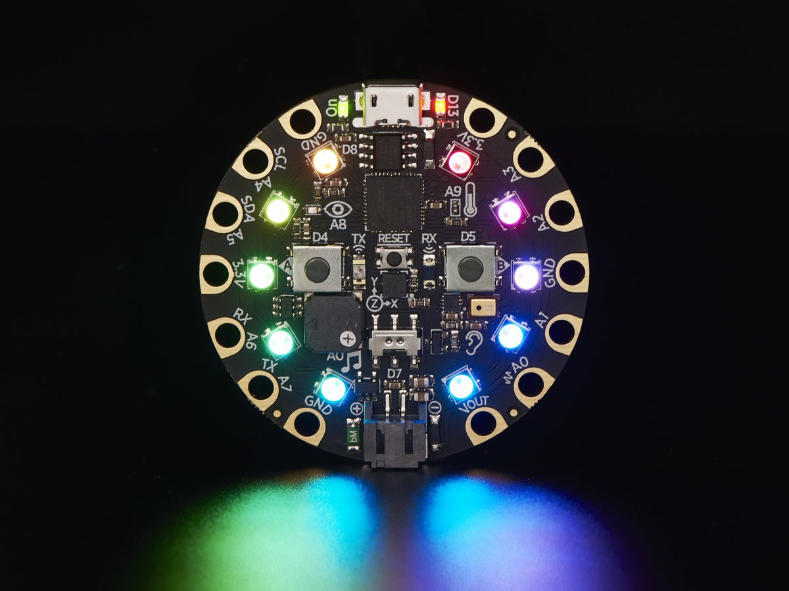

An Installation And User's Guide For 

 

pymata-cpx and FirmataCPx

 

Remotely Monitor And Control 

An Adafruit Circuit Playground Express

Using Python

 

-------------------------------------------------

The [pymata-cpx](https://github.com/MrYsLab/pymata-cpx) library
implements a Python 3 compatible
 [API](https://htmlpreview.github.io/?https://github.com/MrYsLab/pymata-cpx/blob/master/docs/api.html) that makes controlling and
monitoring an
[Adafruit Circuit Playground Express](https://www.adafruit.com/product/3333)
simple and fun to do. 

This package includes the pymata-cpx client library, as well as 
the FirmataCPx firmware that runs on the Playground express.

The pymata-cpx/FirmataCPx combination supports the following Playground Express on-board sensors and actuators:

* The Buttons and Slide Switch
* The D13 Board LED.
* The 10 onboard neo-pixels.
* Tone generation using the onboard speaker.
* The accelerometer, including tap sensing.
* The temperature sensor.
* The light sensor.
* The sound sensor.
* The 7 Touchpad sensors.

A full set of examples is included demonstrating all of the sensors
and actuators listed above.

Last updated 30 December 2019    

Copyright (C) 2019 Alan Yorinks. All Rights Reserved.
